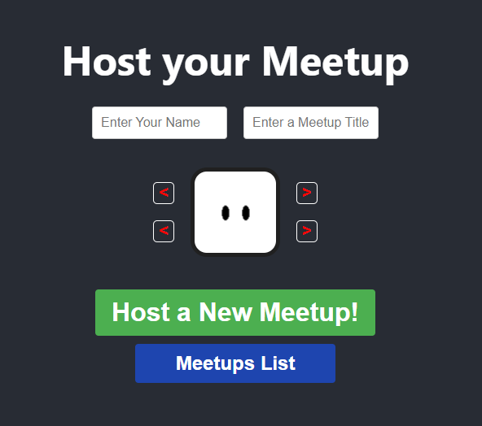

# Meetup Mannaja - Event Organisation

### _Collaborate in realtime with friends!_

Try out this project here: https://elderlyc.github.io/meetup-app

## Introduction

Meetup Mannaja was a way for me to expand upon my skills and knowledge within the realm of front-end web development.

I planned out a project that involved a backend (Firebase) to enable realtime updating of shared data amongst multiple users.

I was able to utilise various features that I had studied to bring my idea to fruition.

Routing, API calls, JSON manipulation, localStorage, state, hooks, and side effects were all used within the app to allow it to function effectively.

Towards the end of development careful attention to CSS, and in particular responsiveness, was given to ensure a smooth and effective UI experience.

## Wireframes to Pages

Making carefully thought out wireframes early on proved exceptionally useful later, as I was able to build a working application exactly as I had envisioned.

### Hosting page

 

### Settings page

 

### Join modal

 

### Shared table page

 

### Meetups list page

 

I hope to continue to make applications that I can proudly use myself as I know that others will find them useful too.

## The Programmer

Hi. I study programming by myself through online resources and am looking for a web development job. I have experience with React (JS, HTML, CSS), Git, and Firebase, and am studying TypeScript and Node.js.

I am always striving to learn about the seemingly endless world of programming, and try to program every day.

## My Other Projects

Although not as polished, I still proudly use my first project _**kiloJoules**_ from time to time when I need a random recipe or am curious about food macros.

You can try it out here: https://elderlyc.github.io/fitness-app

## Special Thanks

To Mike, Baker, Jon, Jose, Joel, and Benji for giving me ideas and helping test out my application.
